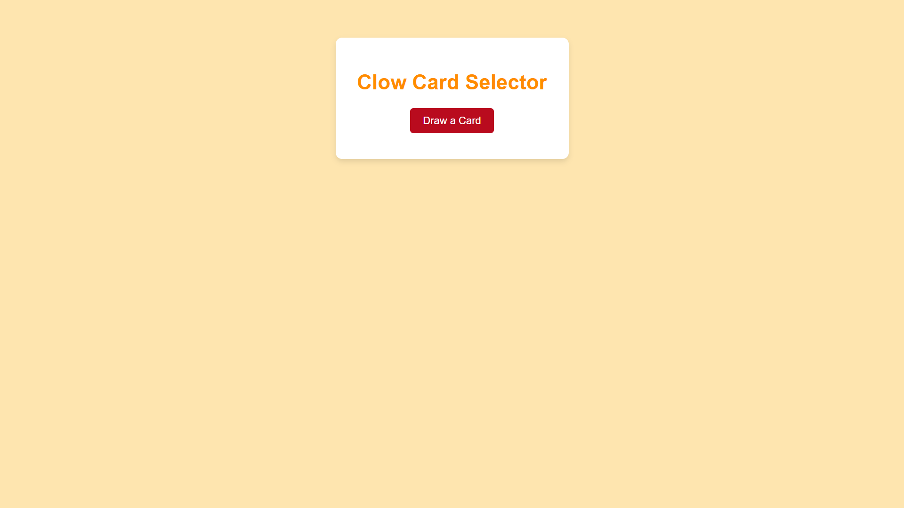
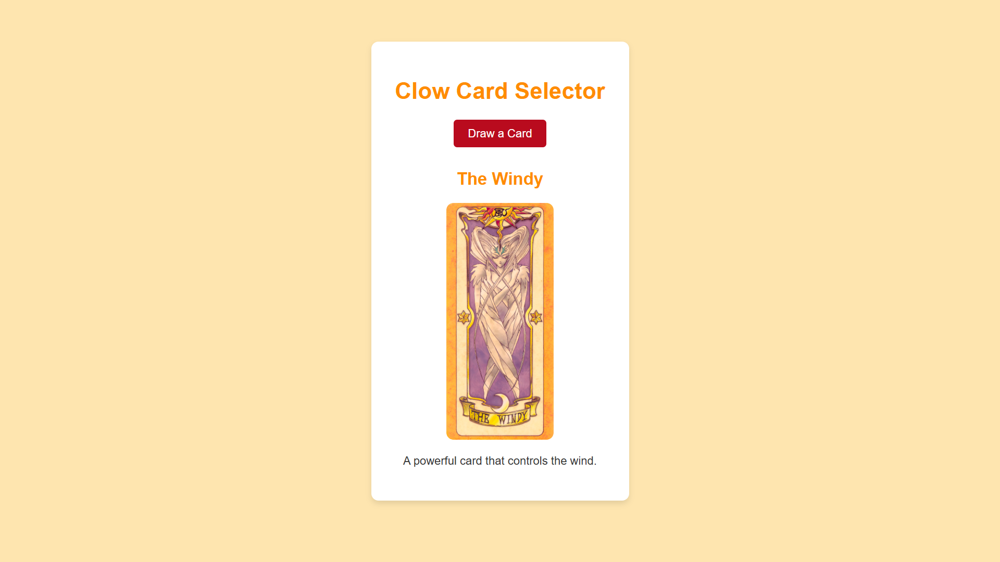

# Clow Card Selector

Clow Card Selector is a simple program that allows users to draw a random Clow Card. As a nostalgic nod to the Cardcaptor Sakura series, it displays the card along with its description.

_This mini project is a recreation of the one I originally built during my earlier undergraduate days. At the time, I didn’t have the opportunity to utilize GitHub for version control and collaboration, and I eventually lost it. Now, I've revisited the Clow Card Selector._